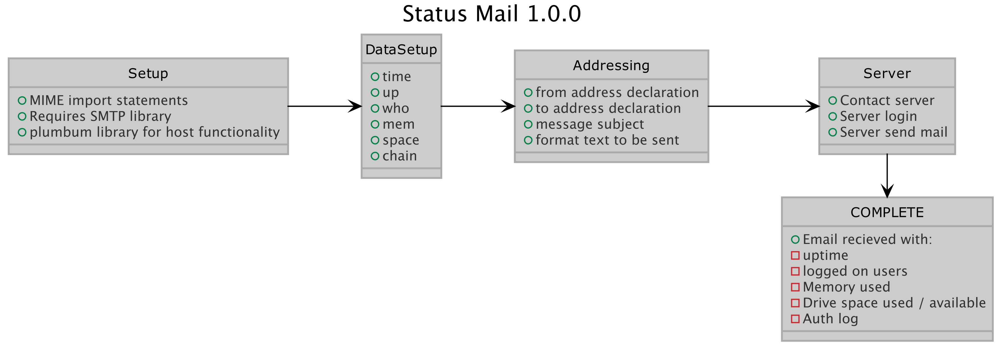

## status_mail

A python script that checks a machine's logged in users, memory stats, drive space and reads out the last lines of the machine auth.log. 

Requires a gmail account for sending the email from the machine being administered.  The recieving email can be any you like.    

The primary library for gathering stats is the plumbum library for python3.  The library allows use of native functions without using os.subprocess.

## Example Usage:

python3 status_mail.py

